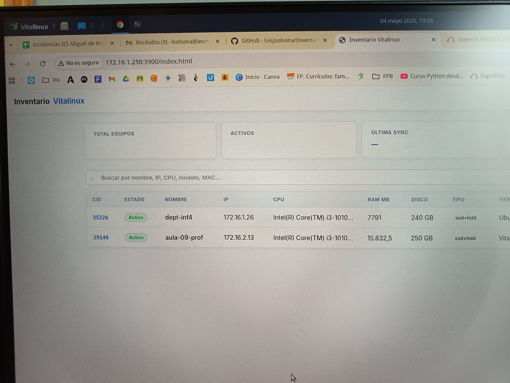
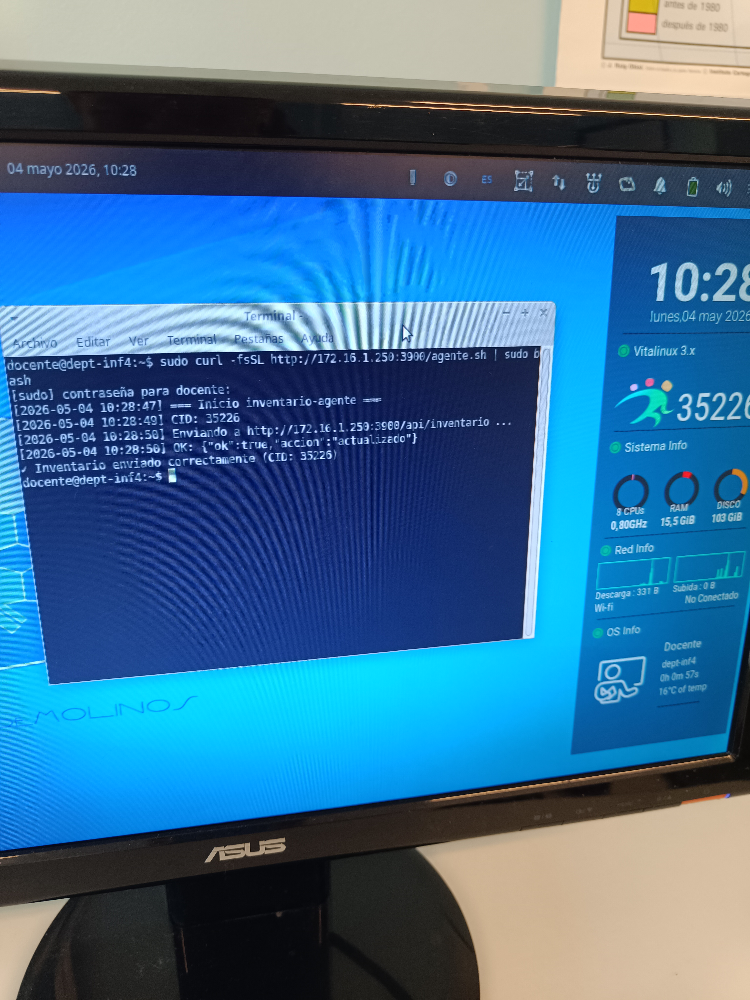
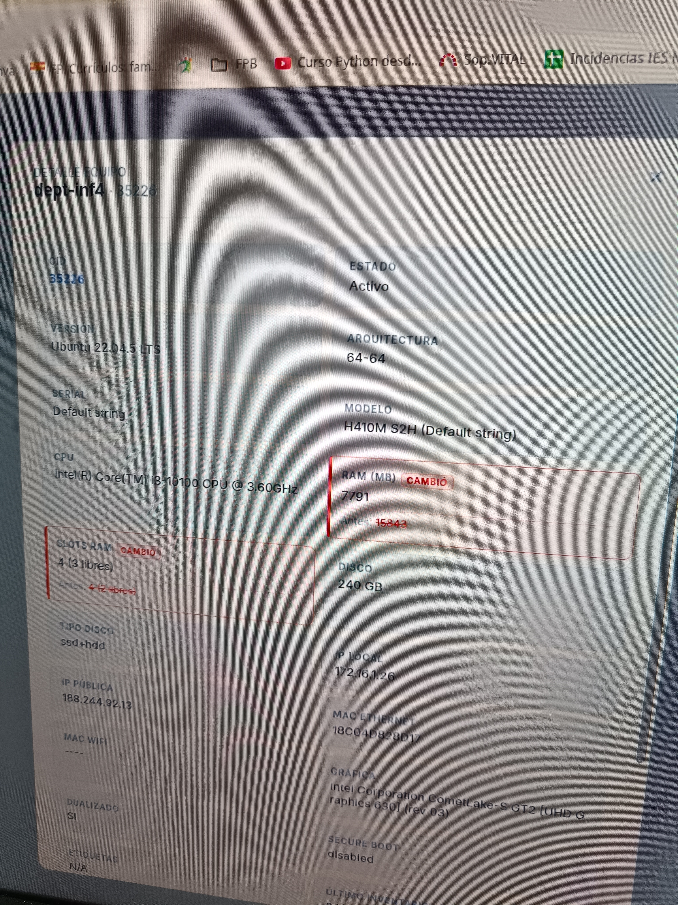
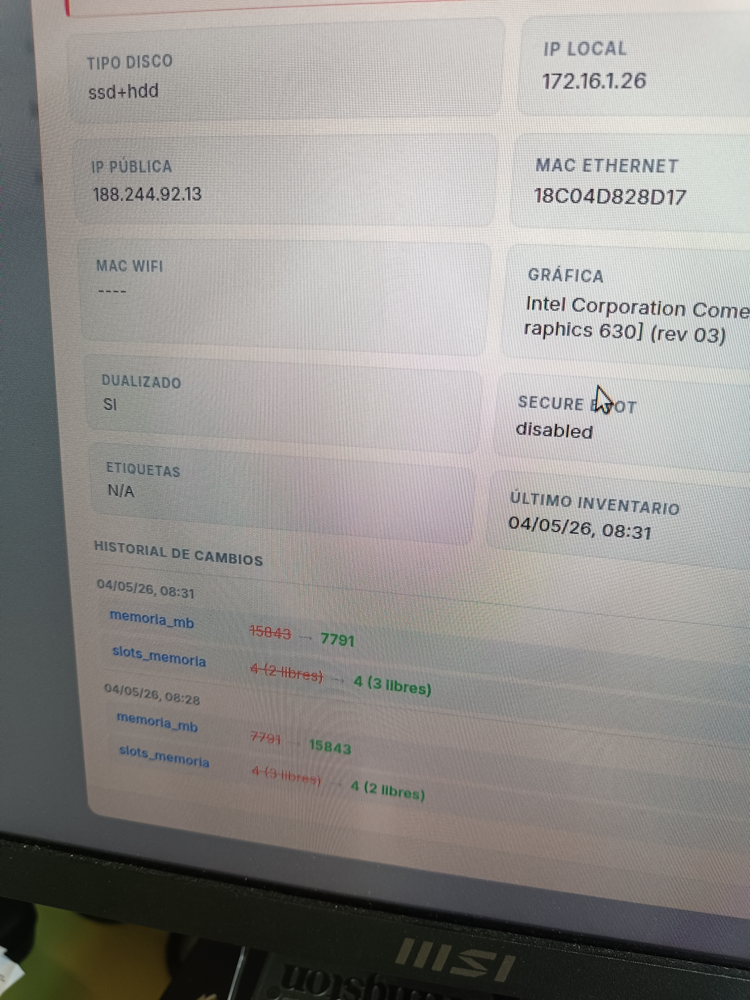

# Inventario Vitalinux

Sistema de inventario hardware centralizado para institutos con equipos Vitalinux. Los equipos cliente recopilan sus datos automáticamente al arranque y los envían al servidor. El administrador visualiza y gestiona el inventario completo desde un dashboard web.

## Funcionalidad principal

La plataforma permite a los técnicos de sistemas llevar un inventario actualizado de todos los equipos del centro sin intervención manual. Un agente Bash ligero, instalado una vez en cada equipo, recoge 21 campos de hardware —CPU, RAM, disco, red, Secure Boot, etiquetas Migasfree, etc.— y los envía al servidor en cada arranque y diariamente a las 08:05. El servidor detecta automáticamente qué campos han cambiado respecto al envío anterior y los registra en un historial por equipo.

### Servidor con Listado de equipos


### Cliente envia su info


### Aviso de cambios en HW


### Historico de cambios en HW



**Para el técnico / administrador:**
- Dashboard web con búsqueda, filtros por versión y tipo de disco, y modal de detalle por equipo
- Campo **Último inventario** en cada equipo — fecha y hora exacta en que el agente se ejecutó por última vez
- **Equipos con cambios marcados en rojo** en el listado general — punto rojo junto al nombre si el último envío detectó algún cambio
- Campos que cambiaron en el último envío resaltados en rojo en el detalle, mostrando el valor anterior y el actual
- Historial de cambios agrupado por ejecución del agente
- Exportación del inventario completo en TSV compatible con LibreOffice Calc y Excel
- Eliminación de equipos con borrado en cascada del historial
- Estadísticas globales: total de equipos, distribución de versiones y tipos de disco

**Notificaciones por correo:**
- El administrador configura un correo Gmail y su contraseña de aplicación desde el botón **Notificaciones** en el header
- Cuando el agente detecta cambios en cualquier campo de hardware, el sistema envía automáticamente un correo con el detalle del equipo y los campos modificados
- Se puede especificar un correo de destino diferente al remitente, o enviarlo al mismo
- Botón de **enviar prueba** para verificar la configuración antes de activarla

**Gestión de usuarios:**
- Tres niveles de acceso: **admin** (gestión total), **tecnico** (lectura y exportación) y **viewer** (solo lectura)
- Panel de administración de usuarios accesible desde el header (solo administradores): crear, editar rol y eliminar usuarios
- Protección para no eliminar el último administrador del sistema
- Cualquier usuario puede cambiar su propia contraseña desde el botón "Mi contraseña" en el header

**Para el agente en los equipos:**
- La página de login muestra el comando de instalación con la IP del servidor ya incluida
- Instalación en un solo comando desde el equipo cliente, sin configuración manual
- Recogida automática de serial, modelo, CPU, RAM, slots de memoria, disco, tipo de disco, MACs ethernet y WiFi, gráfica, IP local, IP pública, Secure Boot y estado de dualizado
- Detección fiable de **slots RAM** usando `dmidecode -t 17` con conteo directo (sin falsos positivos por entradas virtuales del BIOS)
- Detección fiable de **dualizado**: comprueba efibootmgr, directorio EFI/Microsoft y particiones NTFS en discos internos
- **Etiquetas Migasfree** con soporte de estructura de objetos (id/name) además de strings planos
- Integración nativa con Migasfree — usa `migasfree-cid` como identificador y recoge etiquetas del cliente
- Fallback automático al hash de MAC si Migasfree no está disponible

## Implementación técnica

La aplicación usa un diseño cliente-servidor: agente Bash en los equipos Vitalinux, servidor Express con base de datos SQLite y frontend HTML/CSS/JS vanilla con tema claro. La autenticación se gestiona con JWT almacenado en cookie httpOnly con flag sameSite. El token de los agentes se compara con comparación timing-safe para evitar ataques de temporización. El login web incluye rate limiting de 5 intentos por IP cada 10 minutos. Las notificaciones se envían mediante **nodemailer** vía SMTP de Gmail con contraseña de aplicación. La configuración de correo se almacena en la tabla `config` de la propia base de datos. El sistema corre en Docker y es compatible con CasaOS, Linux, Windows y macOS.

## Quick Start

Requiere Docker y Docker Compose. Antes de levantar el servicio, editar `JWT_SECRET`, `API_TOKEN` y `ADMIN_PASS` en `docker-compose.yml`:

```bash
git clone https://github.com/luisjsolsona/Inventario-Vitalinux.git
cd Inventario-Vitalinux
docker compose up -d --build
```

Acceder en `http://localhost:3900`. Las credenciales por defecto son **admin / admin1234** — cambiarlas desde el panel de usuarios o en `docker-compose.yml` antes de desplegar en producción.

## Añadir un equipo cliente al inventario

La página de login del servidor muestra el comando de instalación con la IP ya incluida. En el equipo Vitalinux, ejecutar como root:

```bash
curl -fsSL http://<IP_SERVIDOR>:3900/agente.sh | sudo bash
```

El servidor sirve el script con `SERVER_URL` y `API_TOKEN` ya configurados automáticamente. El agente se instala en `/usr/local/bin/`, registra un cron que lo ejecuta al arranque y cada día a las 08:05, y lanza el primer envío de forma inmediata. El equipo aparece en el dashboard en cuanto el servidor recibe los datos.

**Envío manual o para pruebas**

```bash
sudo /usr/local/bin/inventario-agente.sh
```

El log de cada ejecución queda en `/var/log/inventario-agente.log`.

**Distribución masiva con Migasfree**

Si se usa Migasfree para gestión centralizada, se puede distribuir el agente como fórmula o script post-install copiando `inventario-agente.sh` a `/usr/local/bin/` con permisos 755 y añadiendo la entrada de cron en `/etc/cron.d/inventario-vitalinux`.
